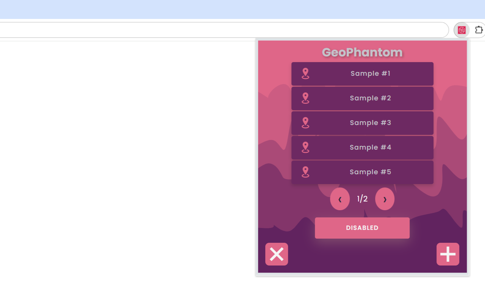

# GeoPhantom  

    
    GeoPhantom is a Chrome extension that allows you to save the names of locations   along with their latitude and longitude coordinates. Once saved, you can easily select   from your saved locations to spoof your browser's location to any.
        

Get it on [Chrome](https://chromewebstore.google.com/detail/geophantom/pjohojbinfgblonnnfgmancpdcpnjjdb)!

## Features

- Save location names with their latitude and longitude coordinates.
- Easily switch between your saved locations to spoof your current location.
- Simple and intuitive user interface.

## Installation

1. Clone or download this repository.
2. Open Chrome and go to `chrome://extensions/`.
3. Enable "Developer mode" at the top right corner.
4. Click on "Load unpacked" and select the directory where you downloaded or cloned this repository.

## Usage

1. Open the extension popup.
2. Click the Plus button.
3. Enter the name, latitude, and longitude of the location you want to save.

    

4. Click "Submit".
5. To spoof your location, select one of the saved locations from the list and click the Disabled Button.

    

6. Your browser's location will now be spoofed to the selected location.

    
     

## Contributing

1. Fork the repository.
2. Create a new branch (`git checkout -b feature-branch`).
3. Make your changes.
4. Commit your changes (`git commit -am 'Add some feature'`).
5. Push to the branch (`git push origin feature-branch`).
6. Create a new Pull Request.

## License

This project is licensed under the MIT License. See the [LICENSE](LICENSE) file for details.

## Contact

For any questions or suggestions, feel free to open an issue or contact me at mikael.nineza@gmail.com.

---

Enjoy using GeoPhantom!
